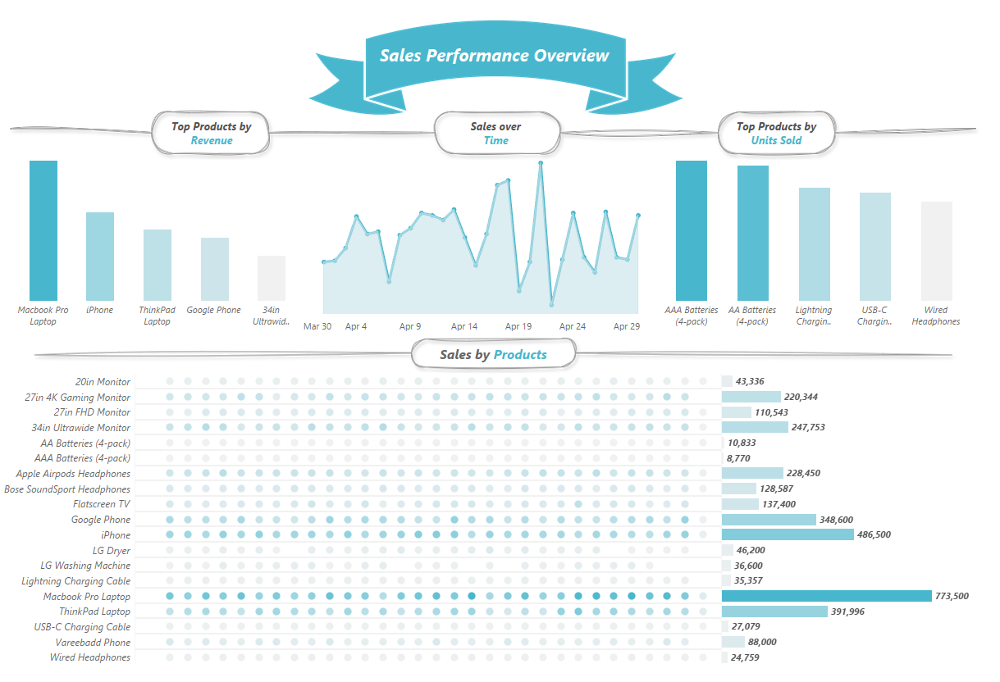

# Sales Performance Analysis

Cleaned and analyzed a month of e-commerce sales data in Python, then built a Tableau dashboard to explore revenue and unit sales by product and over time.

**[View the live dashboard on Tableau Public →](https://public.tableau.com/app/profile/arya.rezvani/viz/SalesProject_17880047958240/Dashboard1)**

## Business Questions

1. Which products generate the most revenue?
2. Which products sell the most units?
3. How do sales change over time?

## Dataset

[`data/Sales_April_2019.csv`](data/Sales_April_2019.csv) — order-level e-commerce sales data for April 2019, with columns: `Order ID`, `Product`, `Quantity Ordered`, `Price Each`, `Order Date`, `Purchase Address`.

## Approach

Cleaning and feature engineering done in Python (`pandas`) — full process in [`sales_project.ipynb`](./sales_project.ipynb):

- Standardized column names to lowercase/underscore format
- Converted `order_date` to proper datetime and `price_each`/`quantity_ordered` to correct numeric types
- Checked for duplicates and nulls
- Parsed `purchase_address` into separate `city` and `state` columns
- Derived new columns to support time-based analysis: `total_amount` (quantity × price), `day_of_week`, `hour`, and `order_day`
- Exported the cleaned dataset to [`clean_sales.csv`](./data/clean_sales.csv), which feeds the Tableau dashboard

## Dashboard

Built in Tableau, combining four views into a single overview:

- **Top products by revenue** — ranks products by total revenue generated
- **Top products by units sold** — ranks products by quantity sold (distinct from revenue ranking — high-volume items aren't always the top earners)
- **Sales over time** — daily revenue trend across April
- **Sales by product** — full product list with unit sales visualized alongside exact figures

## Key Challenge

Getting four different chart types to sit together as one cohesive view was harder than building any single chart — sizing and aligning each element so the dashboard reads clearly at a glance, rather than feeling cluttered, took more iteration than the analysis itself.

## Key Findings

- **Macbook Pro Laptop** is the clear leader in both revenue and general demand, though it doesn't top the units-sold chart — its high price point drives revenue disproportionately to volume
- **AAA and AA Batteries** dominate units sold but rank low on revenue, since they're low-priced, high-frequency purchases — a classic volume-vs-value split worth highlighting for a retailer
- Daily revenue is volatile day to day, with a few sharp spikes rather than a steady trend — worth investigating whether these align with promotions or specific days of the week

## Tools

`Python` · `pandas` · `Tableau`
